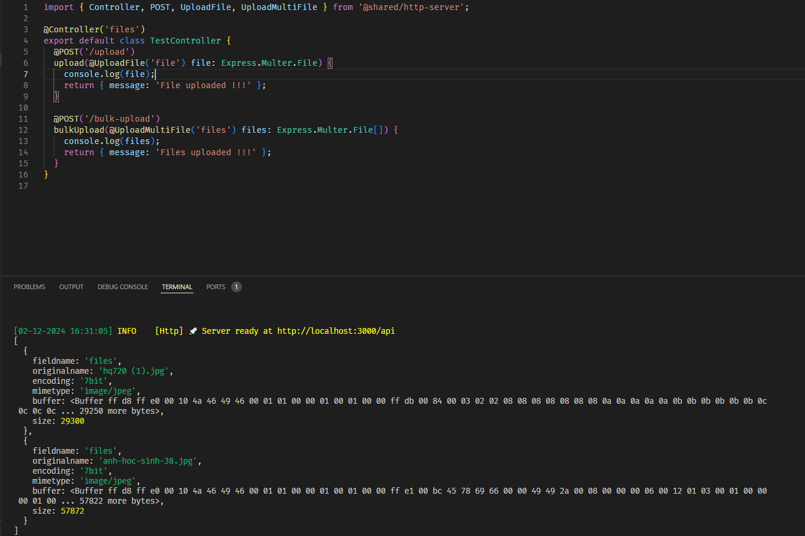
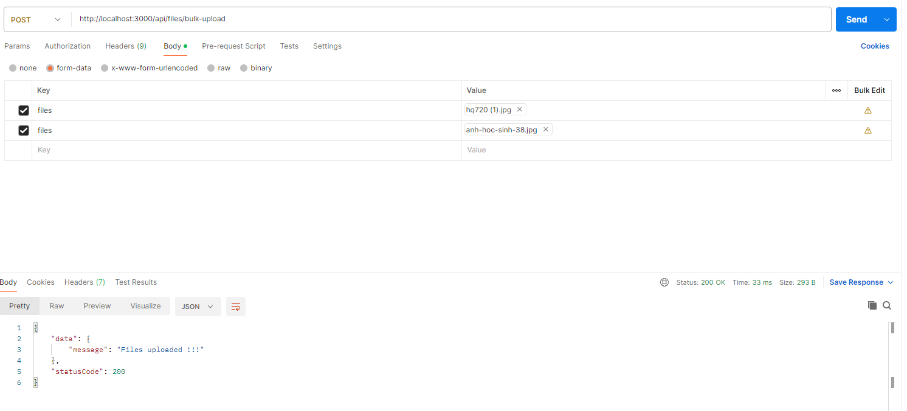
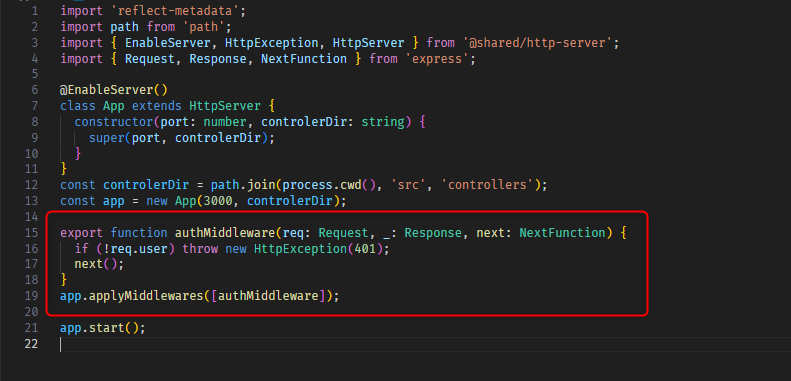
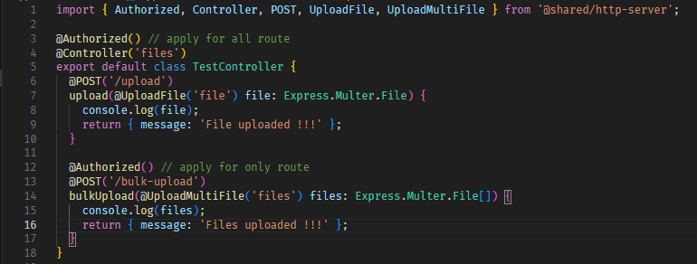

# http-server

Allows to create controller classes with methods as actions that handle requests.
You can use routing-controllers with `express.js`

# Table of Contents

- [Installation](#installation)
- [Example of usage](#example-of-usage)
- [More examples](#more-examples)
  - [Working with json](#working-with-json)
  - [Return promises](#return-promises)
  - [Using Request and Response objects](#using-request-and-response-objects)
  - [Pre-configure express/koa](#pre-configure-expresskoa)
  - [Load all controllers from the given directory](#load-all-controllers-from-the-given-directory)
  - [Prefix all controllers routes](#prefix-all-controllers-routes)
  - [Prefix controller with base route](#prefix-controller-with-base-route)
  - [Inject routing parameters](#inject-routing-parameters)
  - [Inject query parameters](#inject-query-parameters)
  - [Inject request body](#inject-request-body)
  - [Inject request body parameters](#inject-request-body-parameters)
  - [Inject request header parameters](#inject-request-header-parameters)
  - [Inject cookie parameters](#inject-cookie-parameters)
  - [Inject session object](#inject-session-object)
  - [Inject state object](#inject-state-object)
  - [Inject uploaded file](#inject-uploaded-file)
  - [Make parameter required](#make-parameter-required)
  - [Convert parameters to objects](#convert-parameters-to-objects)
  - [Set custom ContentType](#set-custom-contenttype)
  - [Set Location](#set-location)
  - [Set Redirect](#set-redirect)
  - [Set custom HTTP code](#set-custom-http-code)
  - [Controlling empty responses](#controlling-empty-responses)
  - [Set custom headers](#set-custom-headers)
  - [Render templates](#render-templates)
  - [Throw HTTP errors](#throw-http-errors)
  - [Enable CORS](#enable-cors)
  - [Default settings](#default-settings)
  - [Selectively disabling request/response transform](#selectively-disable-requestresponse-transforming)
- [Using middlewares](#using-middlewares)
  - [Use exist middleware](#use-exist-middleware)
  - [Creating your own express middleware](#creating-your-own-express-middleware)
  - [Creating your own koa middleware](#creating-your-own-koa-middleware)
  - [Global middlewares](#global-middlewares)
  - [Error handlers](#error-handlers)
  - [Loading middlewares and controllers from directories](#loading-middlewares-and-controllers-from-directories)
- [Using interceptors](#using-interceptors)
  - [Interceptor function](#interceptor-function)
  - [Interceptor classes](#interceptor-classes)
  - [Global interceptors](#global-interceptors)
- [Creating instances of classes from action params](#creating-instances-of-classes-from-action-params)
- [Controller inheritance](#controller-inheritance)
- [Auto validating action params](#auto-validating-action-params)
- [Using authorization features](#using-authorization-features)
  - [@Authorized decorator](#authorized-decorator)
  - [@CurrentUser decorator](#currentuser-decorator)
- [Using DI container](#using-di-container)
- [Custom parameter decorators](#custom-parameter-decorators)
- [Decorators Reference](#decorators-reference)
  - [Controller Decorators](#controller-decorators)
  - [Controller Method Decorators](#controller-method-decorators)
  - [Method Parameter Decorators](#method-parameter-decorators)
  - [Middleware And Interceptor Decorators](#middleware-and-interceptor-decorators)
  - [Other Decorators](#other-decorators)
- [Samples](#samples)
- [Release notes](#release-notes)

## Installation

### 1. Install module:

   `npm install @thoaiky1992/http-server`

### 2. `reflect-metadata` shim is required:

   `npm install reflect-metadata`

   and make sure to import it before you use `@thoaiky1992/http-server`:

```typescript
import 'reflect-metadata';
```

### 3. Install peer dependencies and their typings:

   `npm install class-transformer class-validator`

   `npm install -D @types/express @types/multer`

### 4. Install peer dependencies:

`npm install class-transformer class-validator`

### 5. Its important to set these options in `tsconfig.json` file of your project:

   ```json
   {
     "emitDecoratorMetadata": true,
     "experimentalDecorators": true
   }
   ```

## Example of usage

### 1. Create a file `src/index.ts`

   ```typescript
    import 'reflect-metadata';
    import path from 'path';
    import { EnableServer, HttpServer } from '@thoaiky1992/http-server';
    

    @EnableServer()
    class App extends HttpServer {
        constructor(port: number, controlerDir: string) {
            super(port, controlerDir);
        }
    }
    const PORT = Number(process.env.PORT || 3000);
    const controlerDir = path.join(process.cwd(), 'src', 'controllers'); // we specify direction controllers we want to use
    const app = new App(PORT, controlerDir);
    app.start();

   ```

### 2. Create a file `src/controllers/app.controller.ts`

   ```typescript
   // this shim is required
    import { Controller, GET } from '@thoaiky1992/http-server';
    import { IsEmail, IsEmpty, IsNotEmpty, IsNumber } from 'class-validator';

    @Controller('test')
    export default class TestController {

        @GET('/say-hello')
        getHello() {
            return 'Hello world !!!';
        }
    }

   ```

### 3. Open in browser `http://localhost:3000/api/test/say-hello`. You will see `This action returns all users` in your browser.

## Inject routing parameters
### 1. `@Req()`, `Res()`
 ```typescript
import { Controller, GET } from '@thoaiky1992/http-server';
import { Request, Response } from 'express';

@Controller('test')
export default class TestController {

    @GET('/say-hello')
    getHello(@Req() request: Request, @Res() response: Response) {
        console.log(request.headers);
        response.status(200).json({ message: 'Hello world !!!' })
    }
}
```
### 1. `@Body()`, `@Params()`, `@Query()`
 ```typescript
import { Controller, GET, POST } from '@thoaiky1992/http-server';
import { Request, Response } from 'express';

@Controller('users')
export default class UserController {

    @POST()
    createUser(@Body() body: UserDTO) {
        const user = await userService.createUser(body);
        response.status(201).json({ data: user })
    }

    @GET()
    createUser(@Query() query: IQuery) {
        const { page } = query;
        const users = await userService.getManyUser(page);
        response.status(200).json({ data: users })
    }

    @GET(':id')
    createUser(@Params() params: IParams) {
        const { id } = params;
        const user = await userService.getUserById(id);
        response.status(200).json({ data: user })
    }
}
```
### 3. `@UploadFile`, `@UploadMultiFile()`
 ```typescript
import { Controller, GET } from '@thoaiky1992/http-server';
import { Request, Response } from 'express';

@Controller('files')
export default class TestController {

    @POST('/upload')
    getHello(@UploadFile('file') file: Express.Multer.File) {
        console.log(file);
        response.status(200).json({ message: 'File uploaded !!!' })
    }

    @GET('/bulk-upload')
    getHello(@UploadMultiFile('files') files: Express.Multer.File[]) {
        console.log(files);
        response.status(200).json({ message: 'Files uploaded !!!' })
    }
}
```
*Example:*





## Method & Class Decoracor for Route:
### 1. `@Authorized()`
In the context of a web application using middleware for user authentication, @Authorized() is typically a decorator or function used to check if the current user has permission to access a specific resource or function. req.user is the user object attached to the HTTP request after the user has been successfully authenticated. The `authMiddleware` is responsible for authenticating the user and assigning the user information to req.user.

When @Authorized() is called, it checks the information in req.user to determine if the user has the necessary permissions. If the user does not have the required permissions, the middleware can return an error or redirect the user to the login page. This helps protect sensitive resources and ensures that only authorized users can access them.

*Example:*



